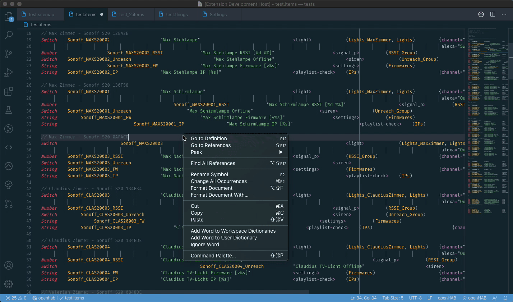
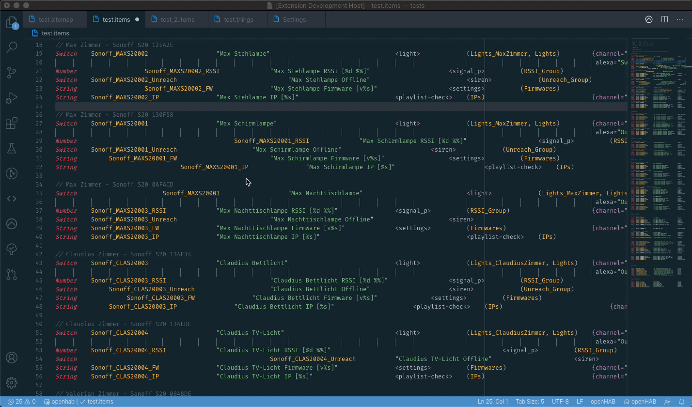
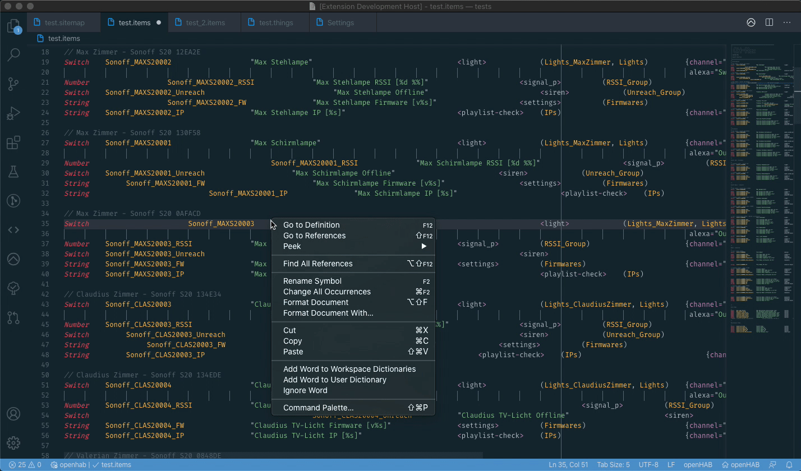

# openHAB Alignment Tool

This extension adds support for formatting and indenting [openHAB](http://www.openhab.org) files like `*.items`, `*.sitemap`, etc. At the moment only `*.items` and `*.sitemap` files are supported. They can be formatted in a column channel-column or multiline style. In the future the other file types
and other format-types will be added. Feel free to add feature-requests on the github repository.

If you've found the extension helpful or useful, then please consider throwing a coffee my way to help support my work. As i am a student and would like to invest more time and effort in this project this would really help me.

## Features

The tool is available as a standard Visual-Studio-Code formatter as it uses the original vsc formatter API. You can force to formatting with right-clicking the document and clicking `Format Document...` or `Format Selection...`. If you have enabled the function in the vsc settings it even can
`Format-On-Save`.

### Item-Formatting:

**Column-Style:**

**Column-Channel-Style:**

**Multiline-Style:**

### Sitemap-Formatting:

## Limitations

The formatting is available for the following openhab file types:

-    `.items` (Fully functional)
-    `.sitemap` (Under development)
-    `.things` (Under development)

## Extension Settings

### New Line After Item

With this option you can choose if you want to have a new line inserted after each item. If there is already a single empty line after an item this settings is ignored.

`"oh-alignment-tool.newLineAfterItem": true`

### Preserve Whitespace

Whitespaces (tabs or spaces) in front of items get preserved and won't be deleted.

`"oh-alignment-tool.preserveWhitespace": true`

### Multiline Indent Amount

With this option you can control the amount of indent when using the Multiline format.

`"oh-alignment-tool.multilineIndentAmount": 28`

### Format Style

The format style option gives you two styles between you can choose.

-    Column
-    ChannelColumn
-    Multiline

The Column style formats the files in a column-way. Each item will be on one line and the item parts are separated in columns. With the ChannelColumn style only the channel part of an item gets formatted into multiple lines. The Multiline format prints every part of an item in a new line and indents
the different parts.

## Known Issues

See [Github Issues](https://github.com/MaxBec/openHAB-Alignment-Tool/issues) file for the details.

## Release Notes

See [CHANGELOG.md](https://github.com/MaxBec/openHAB-Alignment-Tool/blob/master/CHANGELOG.md) file for the details.

---

### For More Information

-    [openHAB Documentation](https://www.openhab.org/docs/)
-    [openHAB Community](https://community.openhab.org)

**Enjoy!**
